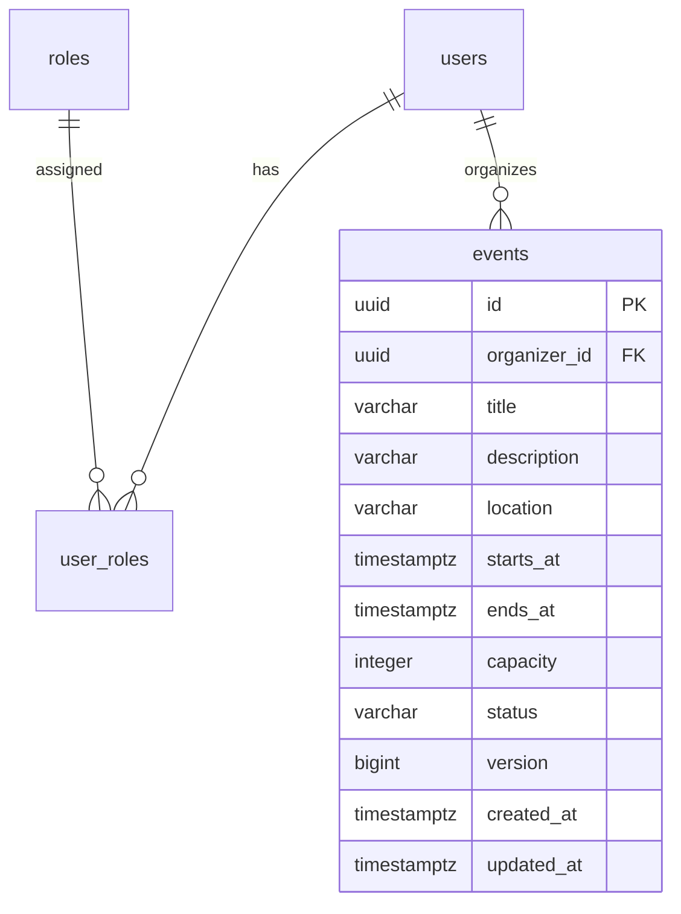

# SEMS database management

PostgreSQL is the system database. Flyway SQL files under `backend/src/main/resources/db/migration` are the source of truth for its schema. Navicat is a supported local client for viewing data and testing queries.

## Rules

1. Create a new timestamped Flyway migration for every schema change.
2. Do not edit a migration after it has been merged or executed in a shared environment.
3. Keep Hibernate `ddl-auto` set to `validate`.
4. Commit schema migrations, reference data, ERD sources and the data dictionary.
5. Do not commit database dumps, PostgreSQL data files, passwords or personal Navicat connection files.
6. Test migrations from an empty PostgreSQL database before merging.

## Sprint 1 tables

| Table | Purpose |
|---|---|
| `users` | Login identity, password hash, status and audit timestamps |
| `roles` | Four supported system roles |
| `user_roles` | Many-to-many assignment of users to roles |

## Sprint 2 events

Migration: `V202609211600__create_events.sql`. No sample events are inserted.

| Column | PostgreSQL type | Meaning / constraint |
|---|---|---|
| `id` | UUID | Primary key |
| `organizer_id` | UUID | Required reference to `users.id`; no cascading deletion |
| `title` | VARCHAR(200) | Required, nonblank |
| `description` | VARCHAR(10000) | Required, nonblank |
| `location` | VARCHAR(500) | Required, nonblank |
| `starts_at`, `ends_at` | TIMESTAMPTZ | Required; start strictly before end |
| `capacity` | INTEGER | Required positive event size, not ticket inventory |
| `status` | VARCHAR(20) | Required; DRAFT (default), PUBLISHED or CANCELLED |
| `version` | BIGINT | Required optimistic-lock version, default 0 |
| `created_at`, `updated_at` | TIMESTAMPTZ | Required; default current timestamp on insert |

Indexes: published events by `(starts_at, id)` (partial index); organizer events by `(organizer_id, created_at DESC, id DESC)`. Substring search currently scans matching published titles; it does not use a full-text index. Public reads always filter `PUBLISHED`. Draft creation and editing now set audit timestamps through JPA lifecycle callbacks. Edit requests compare the supplied version, and JPA optimistic locking prevents concurrent overwrites. Writes use the authenticated organizer ID, and only DRAFT records are editable. Publication requires a future start time. Allowed transitions are DRAFT → PUBLISHED, DRAFT → CANCELLED, and PUBLISHED → CANCELLED. State transitions check the supplied version and use the same optimistic lock as editing. Cancelled records are retained and cannot be restored.

`EventBrowseIntegrationTest` runs against PostgreSQL 17 and verifies both empty-schema migration and upgrading Sprint 1 with existing user and role data. Run with `RUN_CONTAINER_TESTS=true mvn test` from `backend/`.
