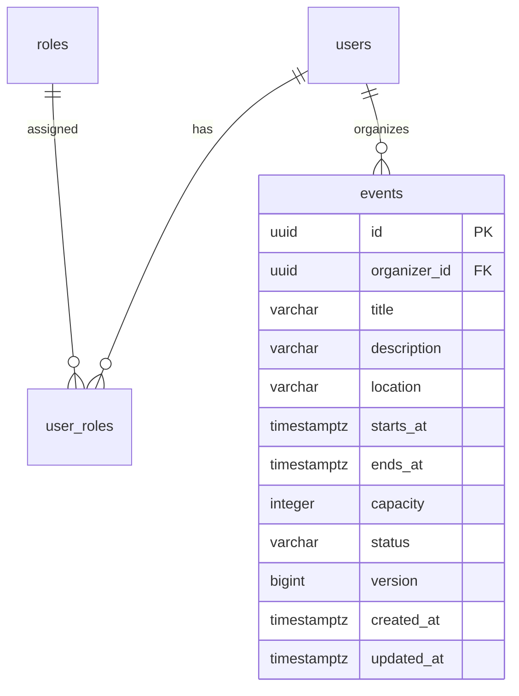
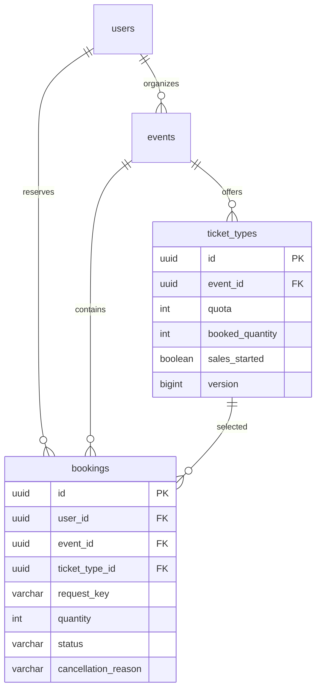

# SEMS database management

PostgreSQL is the system database. Flyway SQL files under `backend/src/main/resources/db/migration` are the source of truth for its schema. Navicat is a supported local client for viewing data and testing queries.

## Rules

1. Create a new timestamped Flyway migration for every schema change.
2. Do not edit a migration after it has been merged or executed in a shared environment.
3. Keep Hibernate `ddl-auto` set to `validate`.
4. Commit schema migrations, reference data, ERD sources and the data dictionary.
5. Do not commit database dumps, PostgreSQL data files, passwords or personal Navicat connection files.
6. Test migrations from an empty PostgreSQL database before merging.

## Sprint 1 tables

| Table | Purpose |
|---|---|
| `users` | Login identity, password hash, status and audit timestamps |
| `roles` | Four supported system roles |
| `user_roles` | Many-to-many assignment of users to roles |

## Sprint 2 events

Migration: `V202609211600__create_events.sql`. No sample events are inserted.

| Column | PostgreSQL type | Meaning / constraint |
|---|---|---|
| `id` | UUID | Primary key |
| `organizer_id` | UUID | Required reference to `users.id`; no cascading deletion |
| `title` | VARCHAR(200) | Required, nonblank |
| `description` | VARCHAR(10000) | Required, nonblank |
| `location` | VARCHAR(500) | Required, nonblank |
| `starts_at`, `ends_at` | TIMESTAMPTZ | Required; start strictly before end |
| `capacity` | INTEGER | Required positive event size; Sprint 3 uses it as the ceiling for total ticket quota |
| `status` | VARCHAR(20) | Required; DRAFT (default), PUBLISHED or CANCELLED |
| `version` | BIGINT | Required optimistic-lock version, default 0 |
| `created_at`, `updated_at` | TIMESTAMPTZ | Required; default current timestamp on insert |

Indexes: published events by `(starts_at, id)` (partial index); organizer events by `(organizer_id, created_at DESC, id DESC)`. Substring search currently scans matching published titles; it does not use a full-text index. Public reads always filter `PUBLISHED`. Draft creation and editing now set audit timestamps through JPA lifecycle callbacks. Edit requests compare the supplied version, and JPA optimistic locking prevents concurrent overwrites. Writes use the authenticated organizer ID, and only DRAFT records are editable. Publication requires a future start time. Allowed transitions are DRAFT → PUBLISHED, DRAFT → CANCELLED, and PUBLISHED → CANCELLED. State transitions check the supplied version and use the same optimistic lock as editing. Cancelled records are retained and cannot be restored.

```mermaid
erDiagram
    users ||--o{ user_roles : has
    roles ||--o{ user_roles : assigned
    users ||--o{ events : organizes
    events {
        uuid id PK
        uuid organizer_id FK
        varchar title
        varchar description
        varchar location
        timestamptz starts_at
        timestamptz ends_at
        integer capacity
        varchar status
        bigint version
        timestamptz created_at
        timestamptz updated_at
    }
```

`EventBrowseIntegrationTest` runs against PostgreSQL 17 and verifies both empty-schema migration and upgrading Sprint 1 with existing user and role data. Run with `RUN_CONTAINER_TESTS=true mvn test` from `backend/`.

## Sprint 3 ticket types and bookings

Migrations: `V202610060400__create_ticket_types.sql` (existing ticket types) and `V202610060500__create_bookings.sql` (booking workflow and first-sale marker). Applied migrations are unchanged. The latter backfills `sales_started=true` where inventory is already booked; no orders are fabricated for historical inventory counters.

### Ticket types

| Column | Type | Meaning / constraint |
|---|---|---|
| id / event_id | UUID | Primary key / event FK |
| name | VARCHAR(100) | Nonblank ticket name |
| price_minor | BIGINT | Nonnegative SGD cents |
| currency | VARCHAR(3) | SGD only |
| quota | INTEGER | Positive quota; event-wide sum validated under the event lock |
| booked_quantity | INTEGER | Between 0 and quota |
| sales_started | BOOLEAN | Permanent first-booking marker; remains true after inventory release |
| version | BIGINT | Optimistic ticket edit version |
| created_at / updated_at | TIMESTAMPTZ | Audit times |

### Bookings

| Column | Type | Meaning / constraint |
|---|---|---|
| id | UUID | Primary key |
| user_id / event_id / ticket_type_id | UUID | Required FKs; history cannot be deleted by deleting its parent |
| request_key | VARCHAR(100) | Nonblank; unique together with user_id |
| quantity | INTEGER | 1–10 tickets |
| unit_price_minor / total_amount_minor | BIGINT | Free bookings only in Sprint 3; total equals unit price × quantity |
| currency | VARCHAR(3) | SGD |
| event_title / event_location | VARCHAR(200) / VARCHAR(500) | Historical event snapshot |
| event_starts_at / event_ends_at | TIMESTAMPTZ | Historical event times |
| ticket_type_name | VARCHAR(100) | Historical ticket name |
| status | VARCHAR(20) | CONFIRMED or CANCELLED |
| payment_status | VARCHAR(20) | NOT_REQUIRED |
| cancellation_reason | VARCHAR(30), nullable | ATTENDEE_CANCELLED or EVENT_CANCELLED; required exactly when cancelled |
| created_at / updated_at | TIMESTAMPTZ | Audit times |

Indexes support `(user_id, created_at DESC, id DESC)` and `(event_id, created_at DESC, id DESC)`. The idempotency unique constraint is `(user_id, request_key)`. PostgreSQL transaction advisory locks serialize same-key requests before taking the event row lock. All supported inventory writers hold the event row lock; cancellation reads the booking after acquiring it. See the [transaction contract](../sprint-3-api.zh-CN.md).

```mermaid
erDiagram
    users ||--o{ events : organizes
    events ||--o{ ticket_types : offers
    users ||--o{ bookings : reserves
    events ||--o{ bookings : contains
    ticket_types ||--o{ bookings : selected
    ticket_types {
        uuid id PK
        uuid event_id FK
        int quota
        int booked_quantity
        boolean sales_started
        bigint version
    }
    bookings {
        uuid id PK
        uuid user_id FK
        uuid event_id FK
        uuid ticket_type_id FK
        varchar request_key
        int quantity
        varchar status
        varchar cancellation_reason
    }
```
