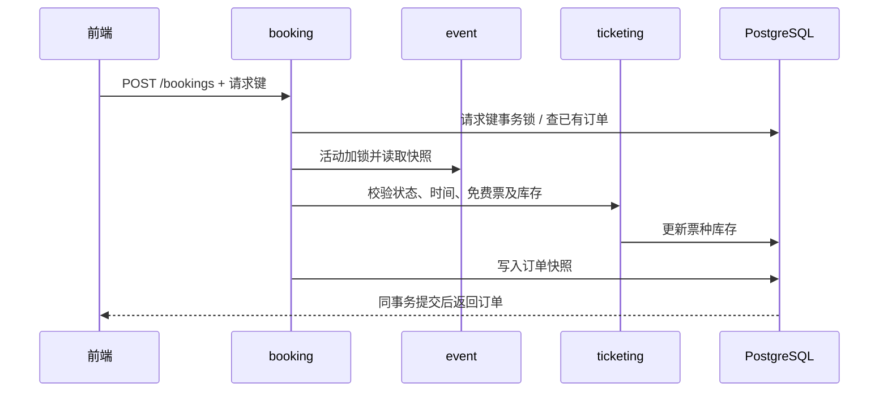

# Sprint 3 接口、权限与事务约定

更新：2026-10-06。实现范围为免费票预订；付费票、支付、二维码及签到进入 Sprint 4。

## 业务规则

- 未来开始的草稿和已发布活动均可配置票种；取消或已开始的活动不能配置。
- 票种名称1–100字符，SGD价格以最小货币单位整数保存，价格非负，配额为正整数。
- 全部票种配额之和不得超过活动容量；修改草稿容量也不能低于已分配总配额。
- 票种第一次预订后名称、价格和配额永久冻结。`salesStarted` 保留此事实，取消后库存归零也不能重新编辑。
- 只允许 ATTENDEE 为尚未开始的已发布活动预订免费票，每单单票种、1–10张。普通公开注册用户默认具有 ATTENDEE。
- 免费订单直接为 `CONFIRMED`、`paymentStatus=NOT_REQUIRED`。用户、金额、活动和票种快照由后端确定。
- 活动开始前可以取消本人订单，状态变为 `CANCELLED`，原因 `ATTENDEE_CANCELLED`。重复取消返回原结果，不重复返还库存。
- 组织者取消活动时，同事务取消全部有效订单，原因为 `EVENT_CANCELLED`。先前已由用户取消的订单保留原原因；公开活动隐藏，订单快照仍可读取。

## 接口

前缀为 `/api/v1`。管理和预订请求携带 `Authorization: Bearer <token>`。列表分页为0起始，默认10条，上限50条，稳定按创建时间及ID倒序。

| 方法与路径 | 访问权限 | 结果 |
|---|---|---|
| GET `/events/{eventId}/ticket-types` | 匿名，仅PUBLISHED活动 | 票种数组；公开响应不含version |
| GET / POST `/organizer/events/{eventId}/ticket-types` | ORGANIZER或ADMIN，本人活动 | 列表 / 创建201 |
| PUT `/organizer/events/{eventId}/ticket-types/{id}` | 同上，满足可编辑规则 | 更新200，需version |
| POST `/bookings` | ATTENDEE | 首次201；同键同请求重放200 |
| GET `/bookings?page=0&size=10` | ATTENDEE，本人 | 分页订单快照 |
| GET `/bookings/{id}` | ATTENDEE，本人 | 单笔订单快照 |
| POST `/bookings/{id}/cancel` | ATTENDEE，本人 | 取消后的快照，重复调用200 |
| GET `/organizer/events/{eventId}/bookings` | ORGANIZER或ADMIN，本人活动 | 分页订单及必要参与者ID，无邮箱或认证信息 |
| POST `/organizer/events/{eventId}/cancel` | ORGANIZER或ADMIN，本人活动 | 沿用version，增加订单取消与库存返还 |

ADMIN没有跨组织者代管能力，STAFF单独角色不能操作上述写接口。未登录401、角色不符403、对象不存在或不属于本人404、输入非法400、售罄/已开始/配置冻结/版本或幂等冲突409。

### 票种请求与响应

```json
{"name":"General admission","priceMinor":0,"currency":"SGD","quota":20}
```

更新时增加 `version`。响应包含 `id`、`eventId`、`name`、`priceMinor`、`currency`、`quota`、`bookedQuantity`、`salesStarted`，管理响应另含 `version`。剩余库存为 `quota - bookedQuantity`。

### 下单请求与幂等

```http
POST /api/v1/bookings
Authorization: Bearer <token>
Idempotency-Key: <one-key-per-logical-request>
Content-Type: application/json
```

```json
{"eventId":"<UUID>","ticketTypeId":"<UUID>","quantity":2}
```

请求键长度1–100字符，数据库唯一范围为 `(user_id, request_key)`。同键必须保持活动、票种及数量一致，否则409。网络重试复用同键；取消后旧键重放返回原取消订单，不能再次占库存。发起新订单必须生成新键。前端在不确定结果待重试时锁定数量。

订单响应字段：`id`、`eventTitle`、`eventLocation`、`eventStartsAt`、`eventEndsAt`、`ticketTypeName`、`quantity`、`unitPriceMinor`、`totalAmountMinor`、`currency`、`status`、`paymentStatus`、`cancellationReason`（取消时存在）、`createdAt`。时间为含时区ISO 8601，界面显示SGT。

组织者列表的items字段：`id`、`attendeeId`、`ticketTypeName`、`quantity`、`status`、`cancellationReason`、`createdAt`。两类分页统一返回 `items/page/size/totalElements/totalPages`。

## 模块边界与一致性

| 模块 | 公开契约 | 职责 |
|---|---|---|
| event | `EventAccessService`、`EventAccessView` | 归属/状态查询，当前事务内活动加锁，活动快照 |
| event | `EventCapacityChanging`、`EventCancelled` | 在持有活动锁时同步发布校验/取消事件 |
| ticketing | `TicketReservationService`、`TicketTypeView` | 库存占用、返还及票种快照 |
| booking | Web API、`BookingView`、`OrganizerBookingView` | 请求幂等、订单持久化、查询和取消 |

不访问其他模块内部Entity或Repository。同步事件由各模块内部监听器处理；不使用异步监听或提交后监听来执行本轮核心写操作。

1. 下单先取得用户与请求键对应的PostgreSQL事务咨询锁，读取已有订单，再取得活动行锁。
2. 票种配置、活动编辑/发布/取消、库存占用/返还、用户取消订单均先取得活动行锁。活动锁保留至整个事务结束。
3. 首次下单在同事务更新库存、写入订单。数据库唯一约束为幂等提供第二道保证。
4. 取消活动的同步监听器按票种ID、订单ID处理有效订单；所有状态及库存写入参加同一事务。
5. 用户取消只先读取不可变的活动ID，取得活动锁后再读取订单实体，避免等待锁期间使用旧状态。



## Sprint 4 交接

下列为下一轮设计输入，尚未实现，不应当作当前接口调用：

- 免费订单确认后，每张票发行唯一凭证；重复处理同一订单不得重复出票。
- 模拟支付采用独立支付记录：待支付→成功/失败/超时，成功后确认订单并出票；待支付占库与超时释放须另行设计和测试。真实网关若为课程必需项，先确认沙箱及回调验签要求。
- 票券状态为有效→已核销或已作废；取消订单/活动使对应票券失效。退款记录不能靠本轮 `CANCELLED` 状态替代。
- 工作人员需要STAFF角色及具体活动授权，核销时检查活动、订单、票券和未核销状态；二维码内容不代替后端授权。
- 建议先完成免费订单出票→工作人员核销，再接支付、通知和报表。Sprint 4末冻结核心功能，Sprint 5用于整体验收和交付。
