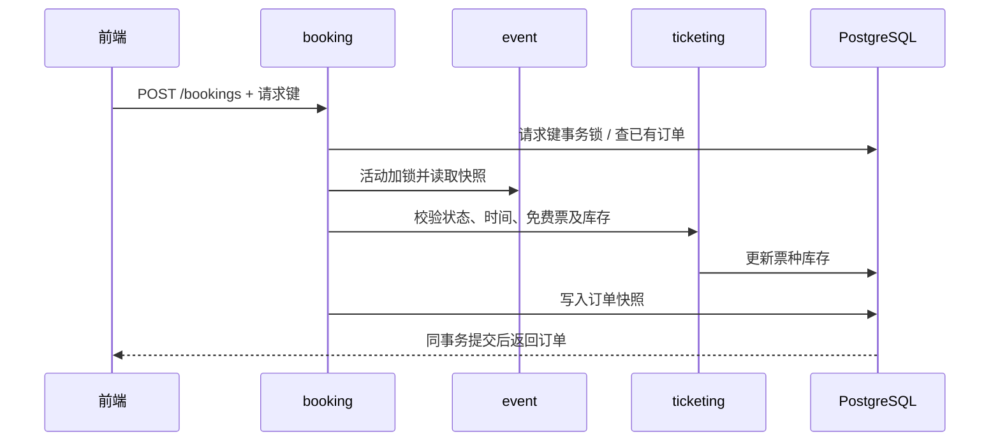

# Sprint 3 接口、权限与事务约定

更新：2026-10-07。实现范围为免费票预订；付费票、支付、二维码及签到进入 Sprint 4。

## 业务规则

- 未来开始的草稿和已发布活动均可配置票种；取消或已开始的活动不能配置。
- 票种名称1–100字符，SGD价格以最小货币单位整数保存，价格非负，配额为正整数。
- 全部票种配额之和不得超过活动容量；修改草稿容量也不能低于已分配总配额。
- 票种第一次预订后名称、价格和配额永久冻结。`salesStarted` 保留此事实，取消后库存归零也不能重新编辑。
- 只允许 ATTENDEE 为尚未开始的已发布活动预订免费票，每单单票种、1–10张。普通公开注册用户默认具有 ATTENDEE。
- 活动可设置 `registrationClosesAt`，不得晚于开始时间；省略时默认开始时间。发布时截止时间必须在未来，达到截止时间后新预订返回409。原请求键重放仍返回已有订单；活动开始前仍可取消订单。
- 免费订单直接为 `CONFIRMED`、`paymentStatus=NOT_REQUIRED`。用户、金额、活动和票种快照由后端确定。
- 活动开始前可以取消本人订单，状态变为 `CANCELLED`，原因 `ATTENDEE_CANCELLED`。重复取消返回原结果，不重复返还库存。
- 组织者取消活动时，同事务取消全部有效订单，原因为 `EVENT_CANCELLED`。先前已由用户取消的订单保留原原因；公开活动隐藏，订单快照仍可读取。

## 接口

前缀为 `/api/v1`。管理和预订请求携带 `Authorization: Bearer <token>`。列表分页为0起始，默认10条，上限50条，稳定按创建时间及ID倒序。

| 方法与路径 | 访问权限 | 结果 |
|---|---|---|
| GET `/events/{eventId}/ticket-types` | 匿名，仅PUBLISHED活动 | 票种数组；公开响应不含version |
| GET / POST `/organizer/events/{eventId}/ticket-types` | ORGANIZER或ADMIN，本人活动 | 列表 / 创建201 |
| PUT `/organizer/events/{eventId}/ticket-types/{id}` | 同上，满足可编辑规则 | 更新200，需version |
| POST `/organizer/events/{eventId}/copy` | ORGANIZER或ADMIN，本人活动 | 复制为新草稿201，含票种配置 |
| GET / PUT `/profile` | 已登录用户，仅本人 | 读取 / 替换常用预订资料 |
| POST `/bookings` | ATTENDEE | 首次201；同键同请求重放200 |
| GET `/bookings?page=0&size=10` | ATTENDEE，本人 | 分页订单快照 |
| GET `/bookings/{id}` | ATTENDEE，本人 | 单笔订单快照 |
| POST `/bookings/{id}/cancel` | ATTENDEE，本人 | 取消后的快照，重复调用200 |
| GET `/organizer/events/{eventId}/bookings` | ORGANIZER或ADMIN，本人活动 | 分页订单、参与者ID及该订单按活动要求填写的信息 |
| POST `/organizer/events/{eventId}/cancel` | ORGANIZER或ADMIN，本人活动 | 沿用version，增加订单取消与库存返还 |

ADMIN没有跨组织者代管能力。任何已登录角色均可维护自己的常用资料；STAFF单独角色不能操作活动或预订写接口。未登录401、角色不符403、对象不存在或不属于本人404、输入非法400、售罄/已开始/配置冻结/版本或幂等冲突409。

### 票种请求与响应

```json
{"name":"General admission","priceMinor":0,"currency":"SGD","quota":20}
```

更新时增加 `version`。响应包含 `id`、`eventId`、`name`、`priceMinor`、`currency`、`quota`、`bookedQuantity`、`salesStarted`，管理响应另含 `version`。剩余库存为 `quota - bookedQuantity`。

### 活动预订信息要求

创建或修改活动草稿时，可以传入 `bookingRequirements`：

```json
{"realName":true,"email":true,"phone":false,"studentId":true,"passport":false,"customFieldLabel":"Department"}
```

五个布尔项分别表示姓名、邮箱、电话、学生证号、护照号是否必填，默认false。`customFieldLabel` 为发布者自定义问题，最多100字符；为null或空白时不要求填写，为非空时对应答案必填。活动公开详情和管理响应均包含此配置。配置仅能在草稿阶段修改，发布后固定，沿用活动的归属检查及version校验。

每笔订单填写一份资料，不按票数重复填写。姓名与登录用户名独立；邮箱默认填入账户邮箱，可改为此次预订的联系邮箱。未选中的字段不显示，后端拒绝提交未要求的资料。

学生证号与护照号为独立选项，可以只要求其中一项，也可以同时要求。对应提交 `studentId` 与 `passportNumber`。自定义问题对应 `customAnswer`，最长500字符。当前验证非空、长度及联系方式格式，不进行证件真实性核验或文件上传。

### 下单请求与幂等

```http
POST /api/v1/bookings
Authorization: Bearer <token>
Idempotency-Key: <one-key-per-logical-request>
Content-Type: application/json
```

```json
{
  "eventId":"<UUID>",
  "ticketTypeId":"<UUID>",
  "quantity":2,
  "attendeeInfo":{
    "realName":"Alice Tan",
    "email":"contact@example.test",
    "studentId":"A1234567",
    "customAnswer":"School of Computing"
  }
}
```

上例对应要求姓名、邮箱、学生证号和Department的活动；无信息要求时可省略 `attendeeInfo`。字符串去除首尾空白，空字符串视为未填写。姓名上限100字符、邮箱255、电话30、证件号100；邮箱和电话另做格式校验。缺失或非法返回400且不会占用库存。资料保存为订单快照，取消后保留，只在本人订单与所属发布者的订单接口返回，公开活动不返回参与者资料。

请求键长度1–100字符，数据库唯一范围为 `(user_id, request_key)`。同键必须保持活动、票种、数量及预订信息一致，否则409。网络重试复用同键；取消后旧键重放返回原取消订单，不能再次占库存。发起新订单必须生成新键。前端在不确定结果待重试时锁定数量和预订信息。

订单响应字段：`id`、`eventTitle`、`eventLocation`、`eventStartsAt`、`eventEndsAt`、`ticketTypeName`、`quantity`、`unitPriceMinor`、`totalAmountMinor`、`currency`、`status`、`paymentStatus`、`cancellationReason`（取消时存在）、`createdAt`、`attendeeInfo`、`customFieldLabel`（自定义问题的订单快照）。时间为含时区ISO 8601，界面显示SGT。

组织者列表的items字段：`id`、`attendeeId`、`ticketTypeName`、`quantity`、`status`、`cancellationReason`、`createdAt`、`attendeeInfo`、`customFieldLabel`（自定义问题的订单快照）。两类分页统一返回 `items/page/size/totalElements/totalPages`。

### 活动时间与报名截止

创建/修改草稿请求可提交 `registrationClosesAt`（ISO 8601时间戳），公开和管理响应均返回此字段。前端显示SGT，输入固定为 `YYYY-MM-DD HH:mm`，可手输或使用日历，不显示秒。报名截止留空时使用开始时间；旧活动迁移后保持开始时截止。

规则为报名截止不晚于开始、结束晚于开始，发布时开始与报名截止均须晚于当前时间。截止后的活动仍可公开查看，页面会自动关闭预订，后端在持有活动锁的事务内再次检查。复制活动时保留截止时间，新草稿需核对时间再发布。

### 复用活动

`POST /organizer/events/{eventId}/copy` 接受本人任意状态的活动，包括已取消活动。复制已保存的标题、描述、地点、时间、容量、预订信息要求及票种名称/价格/配额，返回新的DRAFT。票种生成新ID，已售数量为0，首次销售标记为false；订单和参与者资料不复制。

复制与票种创建同事务完成。原活动保留原状态，过期时间也会原样复制，需要在新草稿修改后才能发布。前端跳转至新草稿供核对；发布失败仍可继续使用已保存的草稿。

### 常用预订资料与隐私

`GET /profile` 和 `PUT /profile` 始终使用JWT中的本人ID，无查看其他用户资料的参数。PUT为替换保存，支持可选字段 `realName/email/phone/studentId/passportNumber`，省略或清空的字段保存为null。请求示例：

```json
{"realName":"Alice Tan","email":"alice@example.test","studentId":"A1234567"}
```

Dashboard的“Saved booking details”用于提前保存。预订页点击“Apply saved details”后，只填入活动要求且已保存的字段；仍可逐项改写。本次修改不写回常用资料。自定义答案因问题随活动变化而不预填。清空常用资料不会修改已有订单。

资料页和预订页均说明信息用途、访问范围与修改行为。常用资料不出现在登录响应、用户管理列表或公开活动中。只有实际提交的订单信息才提供给该活动发布者；其他用户不能读取。资料对象的 `toString()` 已隐藏字段值，避免常规调试输出直接打印个人资料。界面不承诺尚未实现的加密功能。

## 模块边界与一致性

| 模块 | 公开契约 | 职责 |
|---|---|---|
| event | `EventAccessService`、`EventAccessView` | 归属/状态查询，当前事务内活动加锁，活动快照 |
| event | `EventCapacityChanging`、`EventCancelled`、`EventCopied` | 在持有活动锁时同步发布校验/取消/复制事件 |
| ticketing | `TicketReservationService`、`TicketTypeView` | 库存占用、返还及票种快照 |
| booking | Web API、`BookingView`、`OrganizerBookingView` | 请求幂等、订单持久化、查询和取消 |

不访问其他模块内部Entity或Repository。同步事件由各模块内部监听器处理；不使用异步监听或提交后监听来执行本轮核心写操作。

1. 下单先取得用户与请求键对应的PostgreSQL事务咨询锁，读取已有订单，再取得活动行锁。
2. 票种配置、活动编辑/发布/取消、库存占用/返还、用户取消订单均先取得活动行锁。活动锁保留至整个事务结束。
3. 首次下单在同事务更新库存、写入订单。数据库唯一约束为幂等提供第二道保证。
4. 取消活动的同步监听器按票种ID、订单ID处理有效订单；所有状态及库存写入参加同一事务。
5. 用户取消只先读取不可变的活动ID，取得活动锁后再读取订单实体，避免等待锁期间使用旧状态。



## Sprint 4 交接

下列为下一轮设计输入，尚未实现，不应当作当前接口调用：

- 免费订单确认后，每张票发行唯一凭证；重复处理同一订单不得重复出票。
- 模拟支付采用独立支付记录：待支付→成功/失败/超时，成功后确认订单并出票；待支付占库与超时释放须另行设计和测试。真实网关若为课程必需项，先确认沙箱及回调验签要求。
- 票券状态为有效→已核销或已作废；取消订单/活动使对应票券失效。退款记录不能靠本轮 `CANCELLED` 状态替代。
- 工作人员需要STAFF角色及具体活动授权，核销时检查活动、订单、票券和未核销状态；二维码内容不代替后端授权。
- 建议先完成免费订单出票→工作人员核销，再接支付、通知和报表。Sprint 4末冻结核心功能，Sprint 5用于整体验收和交付。

## 用户名与依赖安装授权

- 注册时选择3–50字符用户名，允许英文字母、数字、点、下划线和连字符，保存为小写。相同用户名（包括仅大小写不同）返回409；数据库唯一约束也拦截并发重复注册。Dashboard显示已设置的用户名。
- `frontend/package.json` 的 `allowScripts` 仅批准 `esbuild@0.28.2` 与 `fsevents@2.3.3`。npm 11可用 `npm install-scripts ls` 查看；升级这两个包后需重新审核新版本。


## 开始报名时间与预约预填（2026-10-07）

活动创建、编辑、复制和详情增加可选字段 `registrationOpensAt`（ISO 8601）。为空表示发布后直接报名；设置时必须早于 `registrationClosesAt`（截止留空时取活动开始时间）。页面使用 SGT 和 `YYYY-MM-DD HH:mm`。服务端在预订事务中检查报名时间，未到开始时间的新订单返回 409。

预约仅支持当前已实现的免费票。预约不会占库存、触发首次销售或自动提交订单；人数可以超过活动名额。每个用户每个活动保存一条预约，开售前可修改票种、数量及资料。资料须符合发布者的要求；个人常用资料可应用后再修改。

| 方法与路径 | 行为 |
|---|---|
| `PUT /api/v1/pre-registrations/{eventId}` | 开售前创建/替换本人预约，body 与 BookingInput 相同（eventId、ticketTypeId、quantity、attendeeInfo） |
| `GET /api/v1/pre-registrations?page=0&size=10` | 本人预约分页，size 1–50，更新时间倒序 |
| `GET /api/v1/pre-registrations/{eventId}` | 本人此活动的预填信息；无记录返回 404 |
| `DELETE /api/v1/pre-registrations/{eventId}` | 删除本人保存的记录，返回 204；不取消实际订单 |

以上接口要求 ATTENDEE，用户身份来自登录令牌。预约资料不向发布者或其他用户公开。

响应状态为 `WAITING`（未开售）、`OPEN`（可正式报名）、`CLOSED`（已截止）、`EVENT_CANCELLED`（活动取消）或 `BOOKED`（已创建订单，同时返回 bookingId）。BOOKED 仅表示曾创建关联订单，订单当前有效性以 My orders 为准。个人 Dashboard 展示最近三条，完整页面提供分页和删除；倒计时归零自动显示 Review and book，不自动发请求下单。正式订单依旧使用库存事务和幂等键，用户确认后才消耗名额。

建议普通活动直接开放，名额紧张的活动按需定时开放。当前没有排队、抽签、候补递补或开售通知；并发安全测试不等于大规模抢票压力验收。

## 活动插图与头像

活动草稿接受可选 `illustration`：`GENERAL`（默认）、`TECH`、`MUSIC`、`SPORT`、`ART`、`SOCIAL`。公开和管理视图返回该字段；复制保留；发布后仍可修改。前端映射到内置 SVG，不接受外部图片 URL。

`GET /api/v1/profile/avatar` 返回 `{ "dataUrl": null }` 或本人头像。`PUT` 接收同结构，null 删除头像，成功返回保存结果。所有角色均须登录，用户 ID 来自 JWT，没有读取其他用户头像的接口。

API 只接受 PNG/JPEG base64 data URL，解码文件最多256 KiB、最大512×512；服务端验证实际格式和像素尺寸，再编码为 PNG，移除原始元数据。无效图片返回400。网页允许选择最大5 MiB的 PNG/JPEG，在上传前居中裁剪并缩小到256×256；默认头像不写入数据库。

## 发布前票种配置

发布要求至少一个票种；没有票种返回400，活动仍为DRAFT。检查在活动锁和发布事务内同步执行。草稿管理页不显示订单入口，已发布及已取消活动保留历史订单入口。

`POST /api/v1/organizer/events/{eventId}/ticket-types/default-free` 要求 ORGANIZER/ADMIN 且本人活动，沿用票种可编辑条件。无票种时创建 Free admission、价格0、SGD、配额等于已保存活动容量，返回200。已有同名零价且满容量的单一票种时返回原记录，不重复创建；已有其他配置返回400，需使用票种管理页。此操作不发布活动。

### 已发布活动调整

`PUT /api/v1/organizer/events/{id}` 同时支持草稿和已发布活动，仍需本人权限与当前 `version`。可调整名称、描述、地点、活动及报名时间、插图和容量；容量不能低于票种总配额，活动结束时间须晚于当前时间，报名资料要求发布后固定。已取消活动不可编辑。

个人订单响应新增 `currentEvent`（`title`、`location`、`startsAt`、`endsAt`），供界面展示最新安排；原有活动字段继续保留下单快照，已有订单与库存不因调整而重建。

报名窗口调整规则：尚未开放的已发布活动可以调整报名开始时间；一旦已开放（含发布后立即开放），开始时间固定，后端拒绝修改并返回409。活动时间、地点和报名截止时间仍可按现有规则调整。预订先完成幂等检查、锁定活动和报名资料校验，再预留库存。
